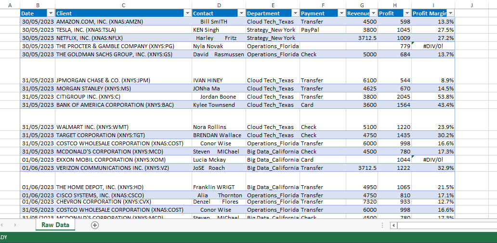
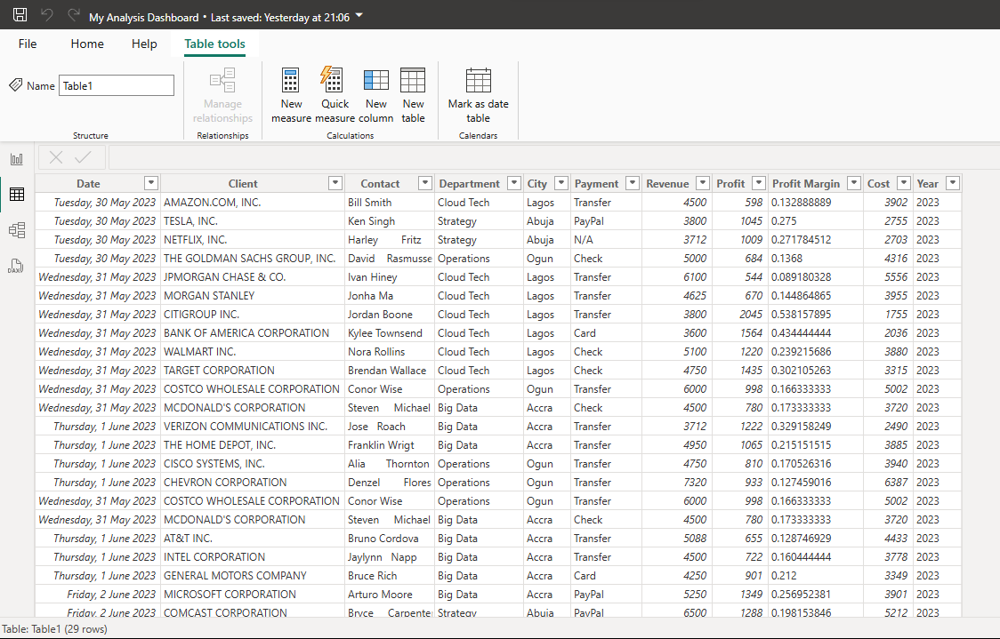
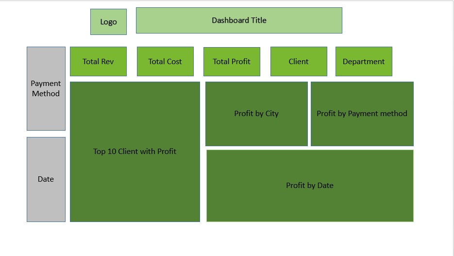
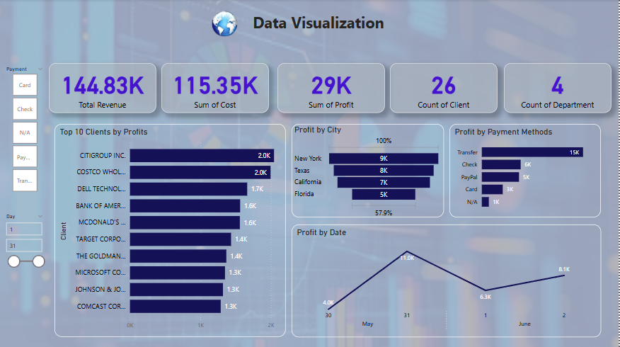

# Wemmy Enterprise Revenue Analysis & Visualization
##  Introduction
This project focuses on analysing and visualizing WEMMY Enterprise's business data to uncover key insights into revenue generation.

##  Problem Statement
Using business data, interactive dashboards and visualizations will be created to answer critical questions such as:
1.  What is cost, revenue and profit in total
2.  Top 10 clients with highest revenue
3.  Revenue trend by period
4.  Which payment method generate most revenue
5.  Countries and their revenue generation

The goal is to transform raw financial and operational data into clear, actionable visualizations (such as charts, graphs, and dashboards) that highlight trends, performance drivers, and growth opportunities.

##  Skills and Expertise Employed/Gained in WEMMY Enterprise Revenue Analysis
-  Data Cleaning & Preparation – Handling missing values, outliers, and formatting inconsistencies
-  Data Analysis – Using statistical methods and tools like Excel to derive insights
-  Data Visualization – Creating charts, graphs, and dashboards using tools like Excel, Power BI
-  Business Intelligence (BI) – Translating data findings into actionable revenue strategies
-  Financial Analysis – Evaluating revenue trends, profitability, and cost-impact relationships
-  Critical Thinking – Identifying key drivers of revenue growth and inefficiencies
-  Report Writing & Presentation – Communicating insights clearly for decision-makers

These skills ensured a thorough and insightful analysis of WEMMY Enterprise’s  revenue performance.

##  Data Modelling

Data in Excel        |Data in Power BI     |My Dashboard Sketch
:-------------------:|:-------------------:|:-------------------:|
   | |

##  Visualization

Dashboard            
:-------------------:

##  Key Analytical Findings: WEMMY Enterprise Revenue Performance
-  Financial Overview:
Total Revenue: ₦144.83K | Total Cost: ₦115.35K | Profit: ₦29K (20% margin).
-  Top-Performing Clients:
Citigroup (highest revenue generator), followed by Costco and Dell Technology (top 3 out of 26 clients).
-  Profit by Location:
New York (highest profit), then Texas, California, and Florida.
-  Payment Method Insights:
Transfer dominated revenue (₦15K—3x higher than card/check methods).
Citigroup & Costco drove 100% of transfer-based revenue.
-  Seasonal Peak:
May recorded the highest monthly revenue (₦11K).
-  Data Gap:
Netflix contributed ₦3.71K, but payment method was unidentified (potential tracking issue).
-  Analyst Note
Transfer payments and key clients (Citigroup, Costco) are major revenue drivers, with location-based profitability highlighting New York as the top market. Payment method clarity (e.g., Netflix) could improve data accuracy.

##  Recommendations & Conclusions
###  Key Recommendations
-  Focus on High-Value Clients – Prioritize Citigroup, Costco, and Dell, as they drive the most revenue. Strengthen relationships and explore upsell opportunities.
-  Expand Transfer Payment Adoption – Since transfers generate 3x more revenue than cards/checks, incentivize more clients to use this method.
-  Optimize Regional Strategy – New York, Texas, and California are top profit centers; allocate more resources to these markets.
-  Improve Data Tracking – Capture missing payment details (e.g., Netflix) to ensure complete financial analysis.
-  Leverage Seasonal Trends – May had peak revenue; plan targeted promotions or campaigns around this period next year.

##  Conclusion
By optimizing transfer payment methods, refining client focus, and enhancing data tracking, profitability can be further improved.
Strategic regional investments and seasonal adjustments will help sustain growth.

